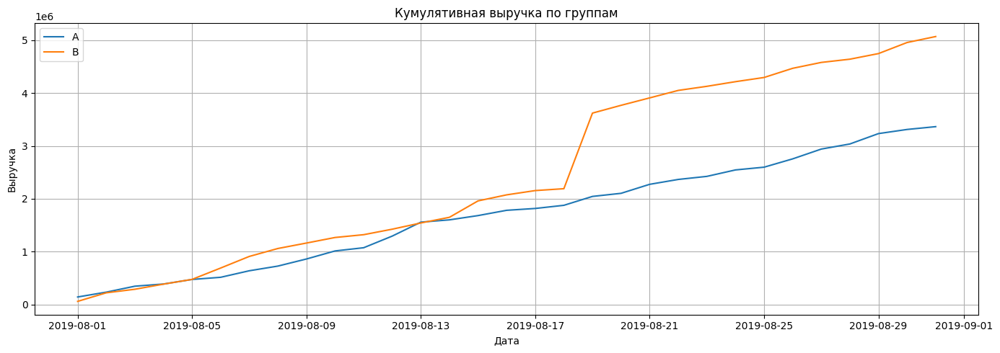
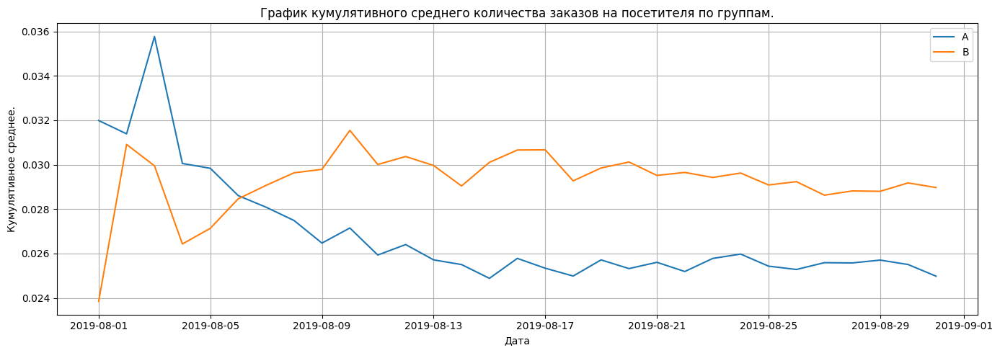
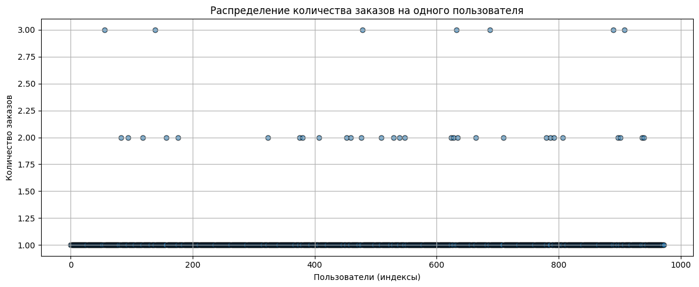
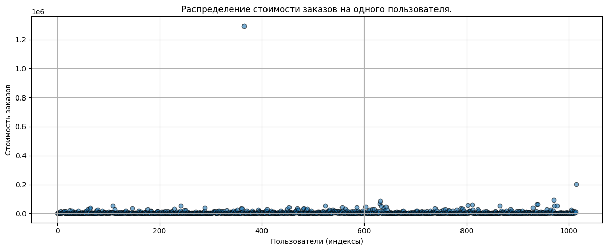

# Приоритизация гипотез и анализ A/B-теста

## О проекте
В проекте решается задача принятия продуктовых решений на основе данных.  
Сначала гипотезы для развития интернет-магазина приоритизируются с помощью фреймворков **ICE** и **RICE**, затем анализируются результаты A/B-теста: рассчитываются кумулятивные метрики, оценивается влияние выбросов и проверяется статистическая значимость различий между группами.

Цель проекта — показать, как с помощью аналитики и статистических методов выбирать наиболее перспективные гипотезы и оценивать эффект продуктовых изменений.

## Бизнес-задача
Интернет-магазину важно принимать решения о развитии продукта на основе данных, а не предположений.

Анализ помогает ответить на ключевые бизнес-вопросы:
- какие гипотезы имеют наибольший потенциал для роста метрик;
- есть ли различия между группами A/B-теста;
- как выбросы влияют на интерпретацию результатов;
- стоит ли внедрять изменение по итогам эксперимента.

## Задачи
- подготовить данные для анализа: загрузить таблицы с гипотезами, заказами и посещениями, привести названия столбцов к единому виду и преобразовать даты;
- приоритизировать продуктовые гипотезы с помощью **ICE** и **RICE** и сравнить результаты ранжирования;
- проверить корректность данных A/B-теста, включая поиск пользователей, попавших одновременно в группы A и B;
- рассчитать и визуализировать **кумулятивные метрики** по группам: выручку и среднее количество заказов на посетителя;
- оценить динамику метрик и различия между группами;
- выявить аномальные значения в данных по числу заказов на пользователя и по стоимости заказов;
- сравнить результаты анализа на «сырых» и очищенных данных;
- проверить статистическую значимость различий между группами с помощью **критерия Манна–Уитни**;
- сформулировать итоговое решение по результатам эксперимента.

## Инструменты и технологии
- **Python** — основной язык анализа данных;
- **pandas** — загрузка, предобработка, объединение таблиц и расчёт кумулятивных метрик;
- **NumPy** — работа с массивами данных, логическими условиями и перцентилями;
- **matplotlib** — построение графиков кумулятивных метрик и визуализация выбросов;
- **SciPy** — статистическая проверка гипотез с помощью **критерия Манна–Уитни**;
- **Jupyter Notebook** — среда для анализа, визуализации и оформления выводов.

## Визуализация проекта

### Кумулятивная выручка по группам

### Кумулятивное среднее количество заказов на посетителя по группам

### Распределение количества заказов на пользователя

### Распределение стоимости заказов

## Структура репозитория
- `README.md` — описание проекта
- `ab_testing_analysis.ipynb` — ноутбук с анализом гипотез, A/B-теста, визуализациями и выводами
- `images/` — графики, используемые в README

## Как открыть проект
Проект представлен в виде Jupyter Notebook с кодом, расчётами, визуализациями и выводами.
